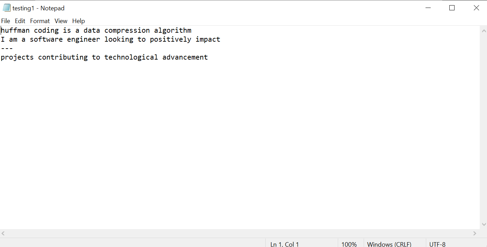
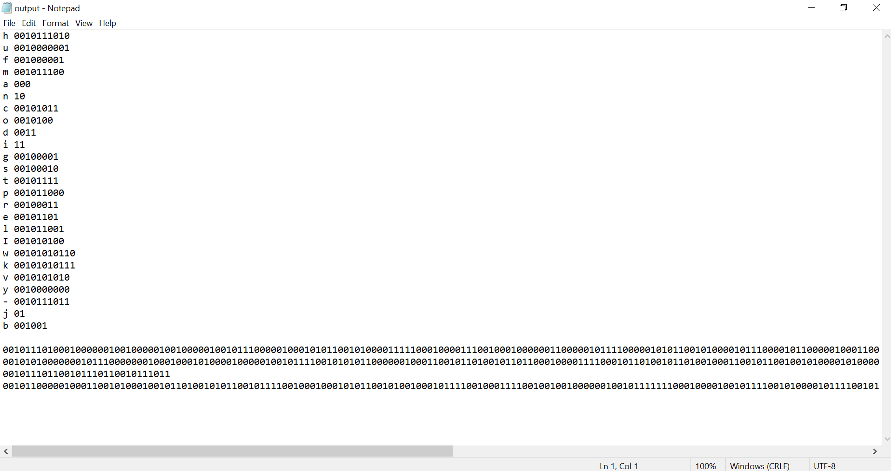
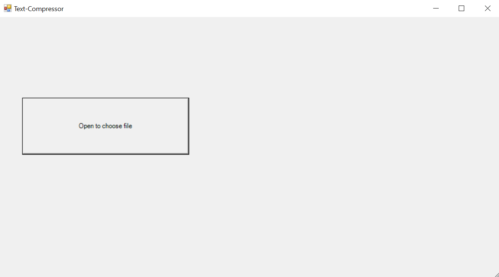
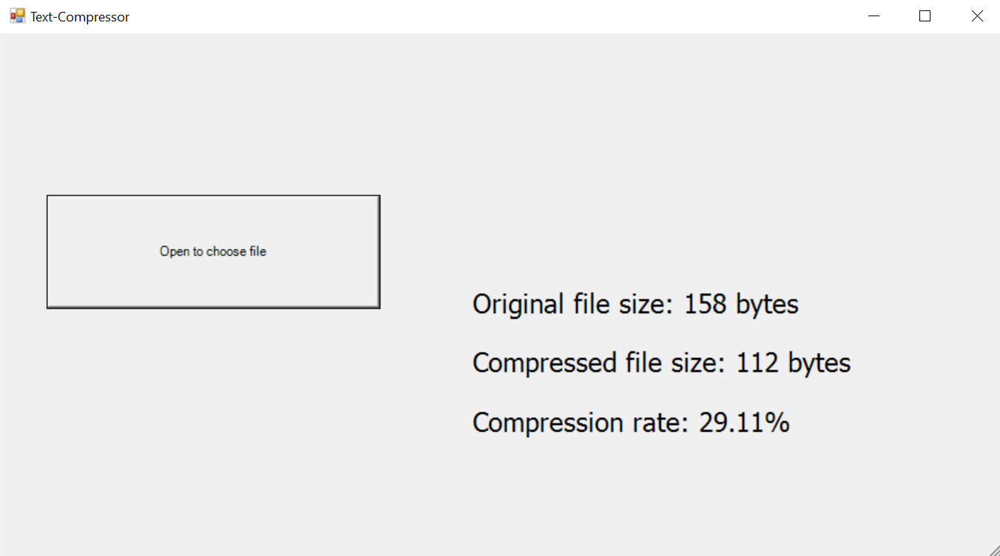
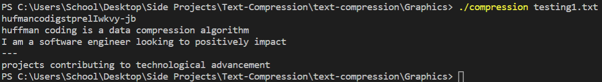

# Loseless Text-Compression Program
# Description #
This program allows a user to upload a .txt file and compress it to a form thats on average ~30% smaller in size whilst maintaining its original integrity. These encoded and compressed files cannot be opened like a normal .txt file. They must be stored appropriately until required for usage. Upon usage run the decoder to get the original .txt file.
 

# Process #
The algorithm uses the huffman coding model to achieve loseless compression. A huffman code is a type of prefix code. The algorithm takes all the unique characters in the .txt file and derives a Huffman tree from the estimated probability or frequency of occurrence of each character amongst all the common characters. Since we know that a .txt file contains characters and symbols where each character/symbol requires a byte (8 bits) of storage; we can encode this to manipulate file size. Instead we store each character in its encoded binary representation. The idea is that characters/symbols that appear more frequently in the file will be represented by a binary representation smaller than 8 bits in size. Characters that don't appear frequently in the file can take up a greater amount of bits. The net size will always be smaller than the original file.
 

